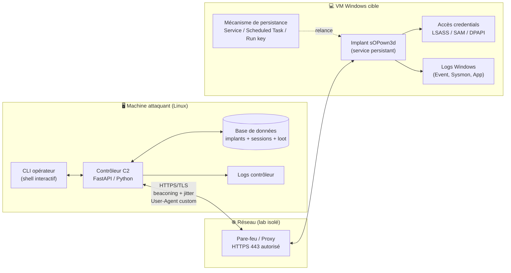
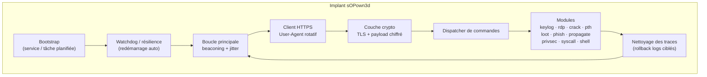

# Vue globale de l'architecture

```mermaid
flowchart LR
    subgraph ATTACKER["🖥️ Machine attaquant (Linux)"]
        CLI["CLI opérateur<br/>(shell interactif)"]
        CTRL["Contrôleur C2<br/>FastAPI / Python"]
        DB[("Base de données<br/>implants + sessions + loot")]
        LOGS_A["Logs contrôleur"]
        CLI <--> CTRL
        CTRL <--> DB
        CTRL --> LOGS_A
    end

    subgraph NET["🌐 Réseau (lab isolé)"]
        FW["Pare-feu / Proxy<br/>HTTPS 443 autorisé"]
    end

    subgraph TARGET["💻 VM Windows cible"]
        IMPLANT["Implant sOPown3d<br/>(service persistant)"]
        PERSIST["Mécanisme de persistance<br/>Service / Scheduled Task / Run key"]
        CREDS["Accès credentials<br/>LSASS / SAM / DPAPI"]
        LOGS_T["Logs Windows<br/>(Event, Sysmon, App)"]
        PERSIST -.->|relance| IMPLANT
        IMPLANT --> CREDS
        IMPLANT --> LOGS_T
    end

    CTRL <-->|"HTTPS/TLS<br/>beaconing + jitter<br/>User-Agent custom"| FW
    FW <--> IMPLANT
```

# Vue de l'implant

```mermaid
flowchart TB
    subgraph IMPLANT["Implant sOPown3d"]
        BOOT["Bootstrap<br/>(service / tâche planifiée)"]
        LOOP["Boucle principale<br/>beaconing + jitter"]
        HTTPC["Client HTTPS<br/>User-Agent rotatif"]
        CRYPTO["Couche crypto<br/>TLS + payload chiffré"]
        DISPATCH["Dispatcher de commandes"]
        MODULES["Modules<br/>keylog · rdp · crack · pth<br/>loot · phish · propagate<br/>privsec · syscall · shell"]
        CLEAN["Nettoyage des traces<br/>(rollback logs ciblés)"]
        WATCHDOG["Watchdog / résilience<br/>(redémarrage auto)"]

        BOOT --> WATCHDOG
        WATCHDOG --> LOOP
        LOOP --> HTTPC
        HTTPC --> CRYPTO
        CRYPTO --> DISPATCH
        DISPATCH --> MODULES
        MODULES --> CLEAN
        CLEAN --> LOOP
    end
```